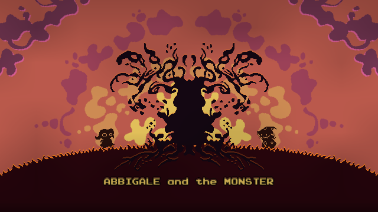
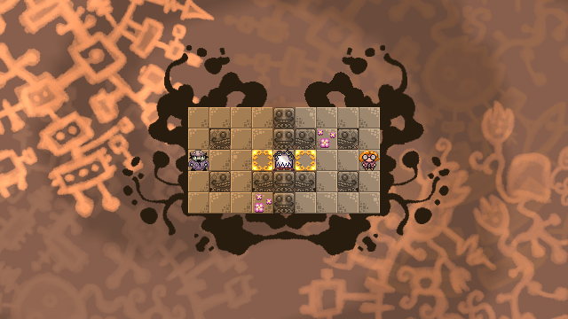
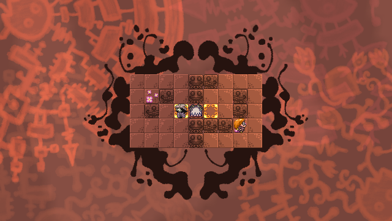
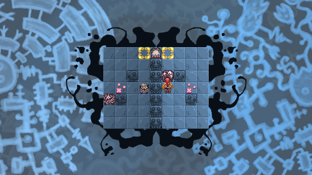
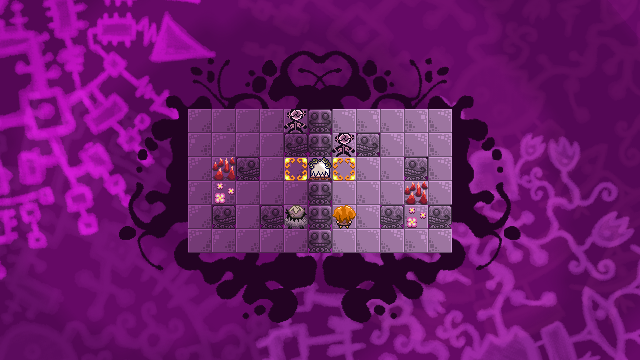
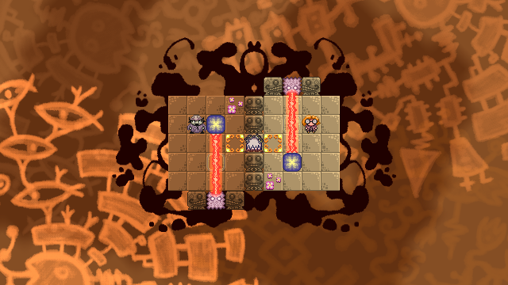

Abbigale and the Monster
========================

[play]: http://www.kongregate.com/games/Igmon/abbigale-and-the-monster/

[Play the game!][play]

##Synopsis
Join Abbigale in a journey to heal the mental madness within herself.

##Gameplay
Top-down puzzle game where you control both Abbigale and the monster. Abbigale must 'see' the monster in order to 'face' her sins.

One must not forget nor run away in order to banish the monster. For the monster is in need of a good hug.

##Screenshots
 
 

##Tools Used
* Unity 3D
* Adobe Photoshop
* Graphics Gale
* Bfxr

##Third-Party Libraries
* NGUI - Neat Unity UI tool.  <http://www.tasharen.com/?page_id=140>. You need a licensed version of this in order to compile the code in this repository.
* 2D Toolkit - 2D tools for building 2D games in Unity. <http://www.unikronsoftware.com/2dtoolkit/>.  You need a licensed version of this in order to compile the code in this repository.
* fastJSON - JSON serializer for C#. <http://www.codeproject.com/Articles/159450/fastJSON>.

##Music Credits
* Composers: Franz Schubert, Frederic Chopin, Claude Debussy
* Performers: Maurizio Machella, Donald Betts, Paul Pitman

~NOTE: All music composed and performed are public domain~
